# StepQuest

**걸어서 번 WP로 하루 10~20분, 사냥터를 하나씩 쓸어 담으며 천천히 강해지는 도트 RPG.**

폰이 센 걸음이 WP(행동력)가 되고, WP로 사냥터에 들어가 몬스터를 잡고 보스를 넘어 다음 지역으로 갑니다.
전투는 자동이고, 고르는 것은 스탯 배분 · 장비(무기 계열) · 물약 · 들어갈 사냥터입니다. Android 전용입니다.

| 문서 | 내용 |
|---|---|
| [implementation_plan.v5.md](implementation_plan.v5.md) | 계획서 — 규칙 · 공식 · 태스크(T번호)와 결정 기록 |
| [MY-TASKS.md](MY-TASKS.md) | 실기기에서 확인할 것 · 답해 줄 것 (`->` 줄이 요청) |
| [balance.md](balance.md) | 밸런스 표 — `npm run balance`가 다시 쓴다 |
| [assets/images/sprite-list.md](assets/images/sprite-list.md) | 그림 목록과 생성 프롬프트 |
| [이미지 갤러리](#이미지-갤러리) | 지금 게임에 들어간 그림 전부 — 이 문서 맨 아래 |

## 개발

```bash
npm install
npm start            # Metro (dev build를 설치한 기기에서 접속)

npm run typecheck    # tsc --noEmit
npm run lint
npm test             # src/ 단위 테스트 (vitest)
npm run format       # prettier
```

작업 하나가 끝나면 `npm run typecheck && npm run lint && npm test`가 통과해야 합니다.

**콘텐츠 · 밸런스 도구** (tools/, vitest로 돈다)

| 명령 | 하는 일 |
|---|---|
| `npm run gen` | 원형(src/content/archetypes)에서 몬스터 · 장비 데이터(src/content/data)를 다시 뽑는다 |
| `npm run validate` | 콘텐츠 데이터 검증 |
| `npm run bench` | 보스 승률 등 전투 벤치 |
| `npm run sim` | 가상의 플레이어로 Lv50까지 며칠 걸리나 |
| `npm run balance` | balance.md를 다시 쓴다 |

## 실기기 dev build (Android)

```bash
npm i -g eas-cli
eas login
eas build --profile development --platform android   # 빌드 완료 후 나오는 QR/링크로 APK 설치
npm start                                             # 설치된 앱에서 Metro 접속
```

Health Connect 등 네이티브 모듈을 쓰므로 Expo Go로는 돌아가지 않습니다.

## 폴더

```
app/              화면 (expo-router) — (tabs)/ 모험 · 캐릭터 · 상점 · 설정, battle · field
src/game/         게임 규칙 — 순수 TS. 숫자와 공식은 전부 formulas.ts 한 곳
src/content/      게임 데이터 — archetypes/(원형, 손으로 고침) → data/(npm run gen이 뽑음)
src/save/         세이브 스키마(zod)와 버전 올리기(migrations)
src/stores/       zustand 스토어 — 화면과 게임 규칙을 잇는다
src/ui/           공용 컴포넌트 · 그림 등록(itemIcons · monsterIcons · arrowIcons)
tools/            콘텐츠 생성 · 검증 · 벤치 · 시뮬 · 그림 자르기
assets/images/    게임에 들어가는 그림 (items/<종류>/ · monsters/<종족>/)
img/              그림 원본 2048px — git에 안 올린다
```

## 규칙

- `src/game/` · `src/content/`는 React를 import하지 않는다 — Node(테스트 · 도구)에서도 돈다.
- 수식과 숫자는 `src/game/formulas.ts`에만 둔다.
- 세이브 모양을 바꾸면 `src/save/migrations.ts`에 한 단계 + 테스트 하나.
- 새 의존성은 먼저 묻고, `npx expo install`로만 넣는다.
- 커밋: `feat(T{N}): 한글 요약` · 문서는 `docs(...)`. 밸런스와 기능 커밋은 나눈다.

## 그림 넣기

1. 원본(2048px, 투명 배경)을 `img/<종류>/<sprite id>.png`로 둔다 — 예: `img/sword/sword_3.png`, `img/slime/slime_1.png`
2. `node tools/crop-sprites.mjs <종류>` — 줄여서 `assets/images/`에 넣는다(인자 없이 돌리면 전부)
   - 장비 · 반지 · 화살 256px → `items/<종류>/`, 몬스터 384px → `monsters/<종족>/`, 보스 512px → `monsters/boss/`
   - 끝나면 [그림 모음 페이지](assets/images/gallery.html)와 아래 갤러리를 다시 쓴다
3. 새 sprite id면 `src/ui/itemIcons.ts`(장비 · 반지 · 화살) · `monsterIcons.ts` · `arrowIcons.ts`(날아가는 화살)에 한 줄씩 —
   React Native는 `require()` 경로를 조합할 수 없어서 한 장에 한 줄입니다

## 이미지 갤러리

종류를 누르면 접힙니다. 종류 고르기 · 칸 크기 조절은 **그림 모음 페이지**에서 합니다 —
`open assets/images/gallery.html`로 브라우저에서 여세요(GitHub에서는 HTML이 소스로만 보입니다).

<!-- gallery:start -->
<details open><summary><b>장검</b> sword · 10</summary>

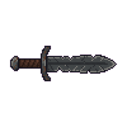 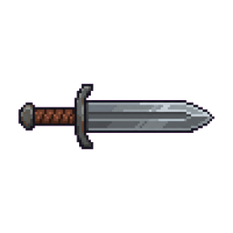 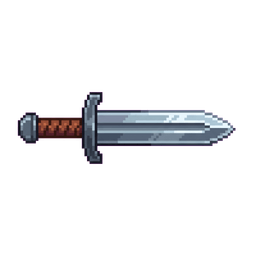 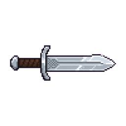 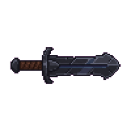 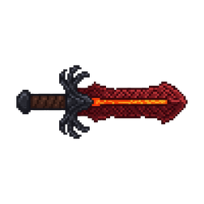 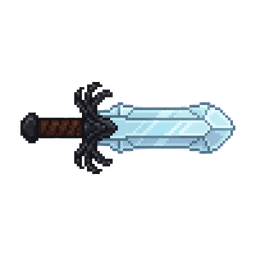 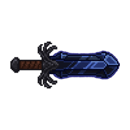 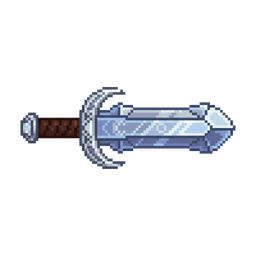 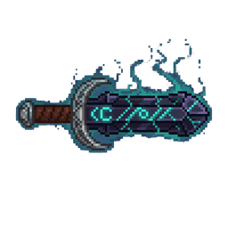

</details>

<details open><summary><b>소검</b> shortsword · 10</summary>

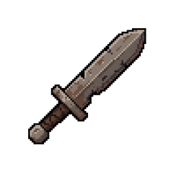 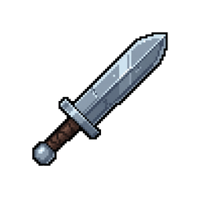 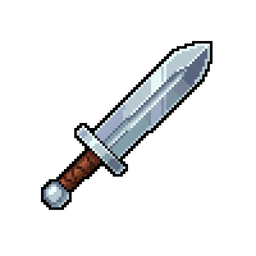 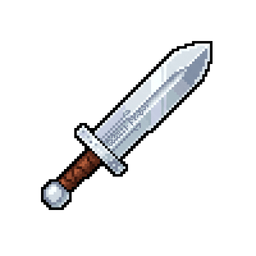 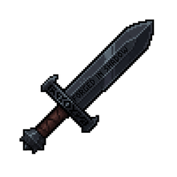 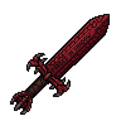 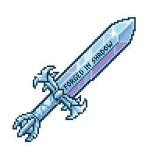 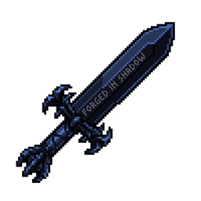 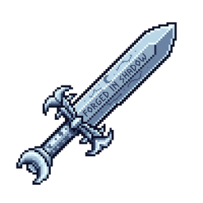 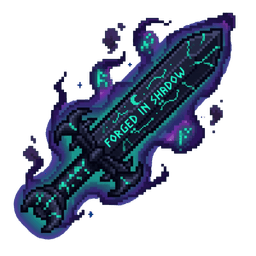

</details>

<details open><summary><b>방패</b> shield · 10</summary>

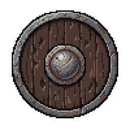 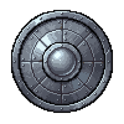 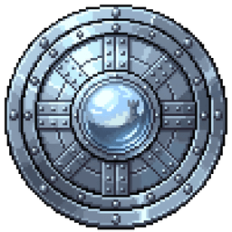 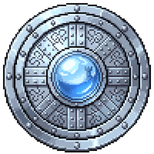 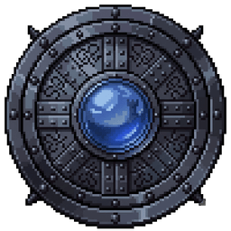 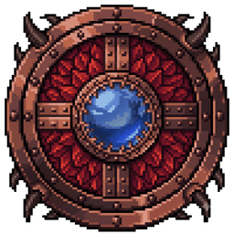 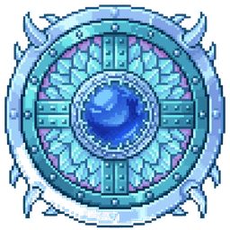 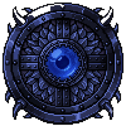 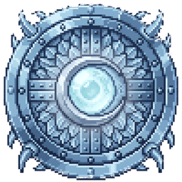 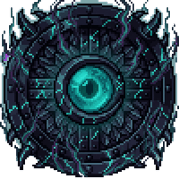

</details>

<details open><summary><b>단검</b> dagger · 10</summary>

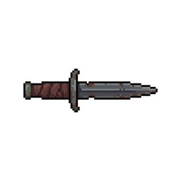 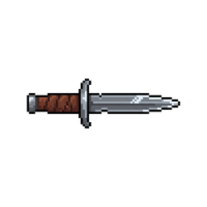 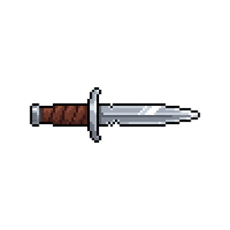 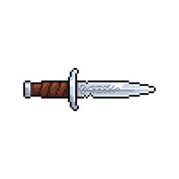 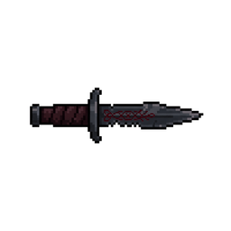 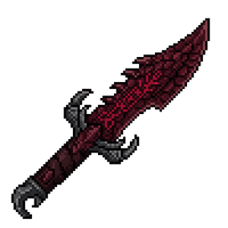 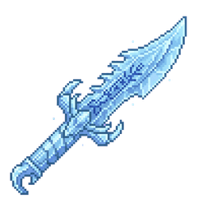 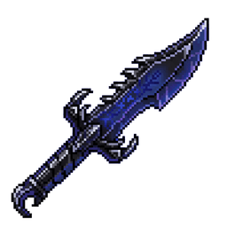 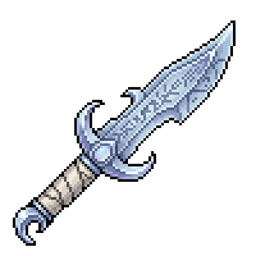 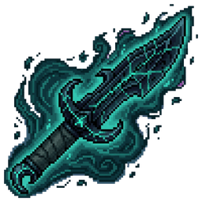

</details>

<details open><summary><b>대검</b> greatsword · 10</summary>

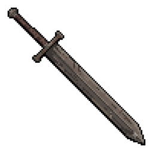 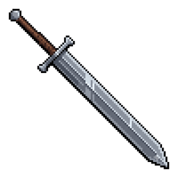 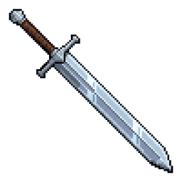 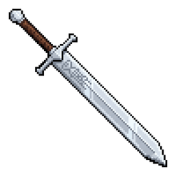 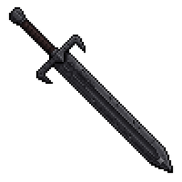 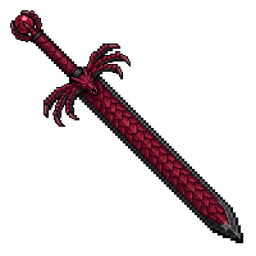 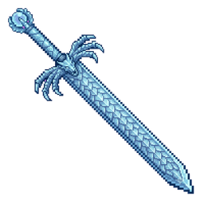 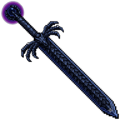 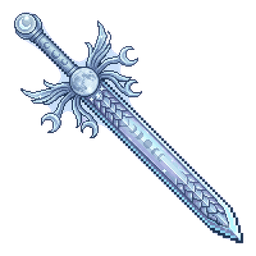 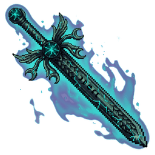

</details>

<details open><summary><b>활</b> bow · 10</summary>

         

</details>

<details open><summary><b>투구</b> helm · 10</summary>

         

</details>

<details open><summary><b>갑옷</b> armor · 10</summary>

         

</details>

<details open><summary><b>하의</b> pants · 10</summary>

         

</details>

<details open><summary><b>장갑</b> gloves · 10</summary>

         

</details>

<details open><summary><b>신발</b> boots · 10</summary>

         

</details>

<details open><summary><b>장신구</b> accessory · 10</summary>

         

</details>

<details open><summary><b>반지</b> ring · 11</summary>

          

</details>

<details open><summary><b>화살</b> arrow · 22</summary>

                     

</details>

<details open><summary><b>보스</b> boss · 6</summary>

     

</details>

<details open><summary><b>수생형</b> aquatic · 6</summary>

     

</details>

<details open><summary><b>인간형</b> bandit · 9</summary>

        

</details>

<details open><summary><b>조류형</b> bird · 11</summary>

          

</details>

<details open><summary><b>마족형</b> demon · 5</summary>

    

</details>

<details open><summary><b>균사형</b> fungus · 6</summary>

     

</details>

<details open><summary><b>소인형</b> goblin · 4</summary>

   

</details>

<details open><summary><b>바위형</b> golem · 10</summary>

         

</details>

<details open><summary><b>벌레형</b> insect · 14</summary>

             

</details>

<details open><summary><b>기갑형</b> knight · 5</summary>

    

</details>

<details open><summary><b>파충류형</b> lizard · 10</summary>

         

</details>

<details open><summary><b>식물형</b> plant · 10</summary>

         

</details>

<details open><summary><b>점액형</b> slime · 13</summary>

            

</details>

<details open><summary><b>정령형</b> spirit · 10</summary>

         

</details>

<details open><summary><b>망령형</b> undead · 15</summary>

              

</details>
<!-- gallery:end -->
