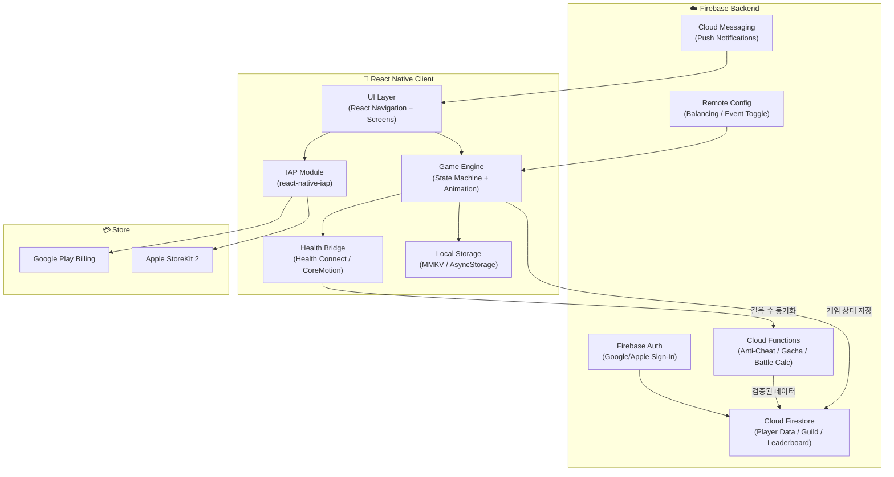

# 🏰 StepQuest — 만보기 방치형 RPG 종합 구현 계획서

> 현실의 걸음이 판타지 세계의 힘이 되는, 만보기 기반 방치형 RPG 모바일 앱

## 1. 프로젝트 개요 및 비전

### 1.1. 핵심 컨셉

**StepQuest**는 사용자의 실제 걸음 수를 핵심 게임 재화(스텝 파워)로 변환하여, 방치형 RPG의 자동 전투·캐릭터 성장·장비 수집과 결합한 **웰니스 게이미피케이션 앱**이다. 단순 만보기를 넘어 직업 스킬 트리, 환생(Prestige) 시스템, 길드 연대, 수집형 가챠까지 깊이 있는 RPG 경험을 제공한다.

### 1.2. 타겟 유저

- **1차 타겟**: 서울 2030 직장인 (출퇴근 보행자, 대중교통 이용자)
- **2차 타겟**: 건강 관리에 관심 있는 전 연령대 모바일 게이머
- **페르소나**: "지하철에서 한 손으로 탭하며, 퇴근 후 폭발적 보상을 확인하는 즐거움"

### 1.3. 기존 기획서 기반 (원본 참조)

> 본 계획서는 [만보기 RPG 기획 고도화.txt](file:///Users/cwre1357/dev/walking_rpg/%EB%A7%8C%EB%B3%B4%EA%B8%B0%20RPG%20%EA%B8%B0%ED%9A%8D%20%EA%B3%A0%EB%8F%84%ED%99%94.txt)를 기술 구현 관점에서 상세 설계한 것이다.

---

## 2. User Review Required

> [!IMPORTANT]
>
> ### 기술 스택 선정 — React Native vs Flutter vs Kotlin Multiplatform
>
> 기획서에서는 React Native를 기반으로 명시하고 있으나, 아래 대안도 검토 가능합니다:
>
> - **React Native (Expo)**: 기획서 원안. JS 생태계, Health Connect 라이브러리 존재, OTA 업데이트 가능
> - **Flutter**: Dart 단일 언어, 픽셀 아트 렌더링에 유리한 CustomPainter, Flame 게임 엔진 내장
> - **Kotlin Multiplatform + Compose Multiplatform**: 네이티브 성능 극대화, Health Connect 공식 지원
>
> **본 계획서는 기획서 원안대로 React Native (Expo managed workflow)를 기준으로 작성합니다.**

> [!WARNING]
>
> ### 백엔드 서버 필수 여부
>
> 길드 시스템, 리더보드, 가챠 천장(pity) 동기화, 환생 데이터 보존 등은 **서버 사이드 로직이 필수**입니다. 본 계획에서는 **Firebase (Firestore + Cloud Functions + Auth)** 를 기본 백엔드로 설정합니다. 자체 서버(Node.js/NestJS 등)로의 전환도 가능하나, MVP 단계에서는 Firebase의 Serverless 모델이 비용 효율적입니다.

> [!CAUTION]
>
> ### 결제 시스템 주의사항
>
> 인앱 결제(IAP)는 Apple App Store / Google Play Store 정책을 반드시 준수해야 합니다. 가상 재화 판매 시 각 스토어의 30% 수수료가 적용되며, 구독형 상품(스텝 패스)은 자동 갱신 구독(Auto-Renewable Subscription) 심사 기준을 충족해야 합니다.

---

## 3. Open Questions

> [!IMPORTANT]
>
> ### Q1. 크로스 플랫폼 범위
>
> iOS 지원이 MVP에 포함되어야 하나요? 아니면 Android 우선 출시 후 iOS를 추가할 예정인가요?
> -> IOS 추가 예정 없음
>
> - Android 전용: Health Connect 단일 통합, 개발 속도 ↑
> - 동시 출시: Expo의 크로스 플랫폼 이점 활용, 시장 커버리지 ↑

> [!IMPORTANT]
>
> ### Q2. 아트 에셋 방향성
>
> - **픽셀 아트 (Retro)**: 제작 비용 ↓, 인디 감성, 용량 ↓
>   -> 픽셀 아트로 생각중
> - **2.5D 아이소메트릭**: 기획서 언급, 제작 비용 ↑, 시각적 몰입감 ↑
> - **일러스트 카드형**: 전투 화면은 카드 기반, 제작 단가 중간
>
> 에셋은 외부 아티스트 혹은 AI 생성(Midjourney/DALL-E) 중 어떤 방식을 선호하시나요?

> [!IMPORTANT]
>
> ### Q3. 서버 인프라 선택
>
> - **Firebase (Serverless)**: 빠른 MVP, 자동 스케일링, 비용 예측 어려움
> - **Supabase (PostgreSQL)**: 오픈소스, SQL 기반, 실시간 구독
> - **자체 서버 (NestJS + PostgreSQL)**: 완전 제어, 초기 세팅 비용 ↑

-> 서버 인프라 각각 장단점이 궁금해 그리고 파이어베이스처럼 서버리스일경우 길드라던지 이런 시스템 구현이 가능해?
아까 너가 서버 필수라며

> [!NOTE]
>
> ### Q4. 광고 SDK
>
> 무과금 유저를 위한 보상형 광고 SDK 선택:
>
> - Google AdMob (가장 보편적)
>   -> 이거 할거야 구글 애드몹과 레베뉴캣을 이용한 인앱결제
> - Unity Ads (게임 특화)
> - AppLovin MAX (미디에이션 통합)

---

## 4. 기술 아키텍처 상세 설계

### 4.1. 시스템 아키텍처 개요



### 4.2. 디렉토리 구조 설계

```
walking_rpg/
├── app.json                          # Expo 설정
├── eas.json                          # EAS Build 설정
├── package.json
├── tsconfig.json
├── babel.config.js
├── metro.config.js
│
├── src/
│   ├── app/                          # Expo Router (파일 기반 라우팅)
│   │   ├── _layout.tsx               # Root Layout (Navigation Container)
│   │   ├── (auth)/                   # 인증 관련 화면
│   │   │   ├── login.tsx
│   │   │   └── onboarding.tsx
│   │   ├── (tabs)/                   # 메인 탭 네비게이션
│   │   │   ├── _layout.tsx           # Tab Navigator 설정
│   │   │   ├── battle.tsx            # ⚔️ 메인 대시보드 (전투)
│   │   │   ├── character.tsx         # 🎒 캐릭터 & 장비
│   │   │   ├── dungeon.tsx           # 🗺️ 탐험 & 던전
│   │   │   ├── summon.tsx            # ✨ 소환 (가챠)
│   │   │   └── social.tsx            # 🏆 소셜 & 길드
│   │   └── (modals)/                 # 모달 화면들
│   │       ├── gacha-result.tsx
│   │       ├── prestige-confirm.tsx
│   │       ├── boss-encounter.tsx
│   │       └── shop.tsx
│   │
│   ├── components/                   # 재사용 UI 컴포넌트
│   │   ├── common/
│   │   │   ├── ProgressBar.tsx
│   │   │   ├── ResourceDisplay.tsx
│   │   │   ├── RarityBadge.tsx
│   │   │   ├── ParticleEffect.tsx
│   │   │   └── GlowText.tsx
│   │   ├── battle/
│   │   │   ├── IdleBattleView.tsx    # 방치 전투 애니메이션 영역
│   │   │   ├── MonsterSprite.tsx
│   │   │   ├── CharacterSprite.tsx
│   │   │   ├── DamageNumber.tsx
│   │   │   └── BiomeBackground.tsx   # 걸음수 기반 배경 전환
│   │   ├── character/
│   │   │   ├── EquipmentSlot.tsx     # 6부위 장비 슬롯
│   │   │   ├── SkillTree.tsx         # 직업별 스킬 트리 노드 맵
│   │   │   ├── StatPanel.tsx
│   │   │   └── JobSelector.tsx       # 직업 선택 UI
│   │   ├── gacha/
│   │   │   ├── LampAnimation.tsx     # 마법 램프 열기 연출
│   │   │   ├── ShardProgress.tsx     # 조각 수집 진행도
│   │   │   └── PityCounter.tsx       # 천장 카운터
│   │   └── social/
│   │       ├── GuildCard.tsx
│   │       ├── LeaderboardRow.tsx
│   │       └── WeeklyChallengeBar.tsx
│   │
│   ├── core/                         # 핵심 게임 로직 (Pure TypeScript)
│   │   ├── engine/
│   │   │   ├── BattleEngine.ts       # 전투 연산 (DPS, 크리티컬, 속성)
│   │   │   ├── IdleCalculator.ts     # 오프라인 보상 계산
│   │   │   ├── StepConverter.ts      # 걸음수 → 스텝파워 변환
│   │   │   └── PrestigeEngine.ts     # 환생 시스템 로직
│   │   ├── models/
│   │   │   ├── Player.ts             # 플레이어 데이터 모델
│   │   │   ├── Character.ts          # 캐릭터 (레벨, 스탯, 직업)
│   │   │   ├── Equipment.ts          # 장비 (등급, 옵션, 세트 효과)
│   │   │   ├── Monster.ts            # 몬스터 정의
│   │   │   ├── Pet.ts                # 펫 시스템
│   │   │   ├── Skill.ts              # 스킬 노드 정의
│   │   │   ├── Biome.ts              # 지형/구역 정의
│   │   │   └── Guild.ts              # 길드 데이터 모델
│   │   ├── constants/
│   │   │   ├── GameBalance.ts        # 밸런스 상수 (경험치 곡선, 골드 비율 등)
│   │   │   ├── ItemDatabase.ts       # 전체 아이템 DB (등급별)
│   │   │   ├── MonsterDatabase.ts    # 몬스터 DB (스테이지별)
│   │   │   ├── SkillDatabase.ts      # 직업별 스킬 트리 DB
│   │   │   ├── BiomeConfig.ts        # 바이옴 전환 기준 걸음수
│   │   │   └── GachaRates.ts         # 가챠 확률 테이블
│   │   └── utils/
│   │       ├── FormulaHelper.ts      # 수학 공식 유틸 (EXP 곡선, DPS 등)
│   │       ├── TimeHelper.ts         # 시간 계산 유틸
│   │       └── AntiCheat.ts          # 클라이언트 사이드 어뷰징 1차 필터
│   │
│   ├── services/                     # 외부 서비스 연동 계층
│   │   ├── health/
│   │   │   ├── HealthService.ts      # 통합 헬스 인터페이스
│   │   │   ├── HealthConnectAdapter.ts  # Android Health Connect
│   │   │   ├── CoreMotionAdapter.ts     # iOS CoreMotion / HealthKit
│   │   │   └── StepValidator.ts      # 케이던스 기반 어뷰징 필터링
│   │   ├── firebase/
│   │   │   ├── AuthService.ts        # 인증 (Google/Apple Sign-In)
│   │   │   ├── PlayerService.ts      # 플레이어 데이터 CRUD
│   │   │   ├── GuildService.ts       # 길드 데이터 CRUD
│   │   │   ├── LeaderboardService.ts # 리더보드 관리
│   │   │   └── RemoteConfigService.ts # 원격 밸런스 설정
│   │   ├── iap/
│   │   │   ├── IAPService.ts         # 인앱 결제 통합
│   │   │   ├── SubscriptionManager.ts # 구독 상태 관리 (스텝 패스)
│   │   │   └── ReceiptValidator.ts   # 영수증 서버 검증
│   │   ├── ads/
│   │   │   └── RewardedAdService.ts  # 보상형 광고 관리
│   │   └── notification/
│   │       └── PushService.ts        # FCM 푸시 알림
│   │
│   ├── store/                        # 상태 관리 (Zustand)
│   │   ├── usePlayerStore.ts         # 플레이어 전역 상태
│   │   ├── useBattleStore.ts         # 전투 상태
│   │   ├── useStepStore.ts           # 걸음수/스텝파워 상태
│   │   ├── useInventoryStore.ts      # 인벤토리 상태
│   │   ├── useGuildStore.ts          # 길드 상태
│   │   └── useSettingsStore.ts       # 앱 설정 상태
│   │
│   ├── hooks/                        # 커스텀 React Hooks
│   │   ├── useStepTracker.ts         # 걸음수 실시간 추적
│   │   ├── useIdleBattle.ts          # 방치 전투 타이머
│   │   ├── useBiomeTransition.ts     # 바이옴 전환 감지
│   │   ├── useOfflineReward.ts       # 오프라인 보상 계산
│   │   └── usePrestige.ts           # 환생 가능 여부 감지
│   │
│   ├── assets/                       # 정적 에셋
│   │   ├── sprites/                  # 캐릭터/몬스터 스프라이트
│   │   ├── backgrounds/              # 바이옴 배경 이미지
│   │   ├── icons/                    # UI 아이콘
│   │   ├── effects/                  # 파티클/이펙트 에셋
│   │   ├── sounds/                   # SFX & BGM
│   │   └── fonts/                    # 커스텀 폰트
│   │
│   └── i18n/                         # 다국어 지원
│       ├── ko.json                   # 한국어 (기본)
│       └── en.json                   # 영어
│
├── firebase/                         # Firebase 백엔드
│   ├── firestore.rules               # Firestore 보안 규칙
│   ├── firestore.indexes.json        # 인덱스 설정
│   └── functions/
│       ├── src/
│       │   ├── index.ts              # Cloud Functions 진입점
│       │   ├── validateSteps.ts      # 서버 사이드 걸음수 검증
│       │   ├── processGacha.ts       # 가챠 서버 사이드 처리
│       │   ├── calculateIdleReward.ts # 오프라인 보상 서버 연산
│       │   ├── guildManager.ts       # 길드 로직
│       │   ├── leaderboard.ts        # 리더보드 정산
│       │   ├── verifyReceipt.ts      # IAP 영수증 검증
│       │   └── scheduledTasks.ts     # 정기 작업 (일/주간 리셋)
│       ├── package.json
│       └── tsconfig.json
│
├── docs/                             # 프로젝트 문서
│   ├── game-design.md                # 게임 디자인 문서
│   ├── api-spec.md                   # API 명세
│   ├── balance-sheet.md              # 밸런스 시트
│   └── art-guide.md                  # 아트 가이드
│
└── __tests__/                        # 테스트
    ├── core/
    │   ├── BattleEngine.test.ts
    │   ├── IdleCalculator.test.ts
    │   ├── StepConverter.test.ts
    │   └── PrestigeEngine.test.ts
    ├── services/
    │   └── StepValidator.test.ts
    └── components/
        └── ProgressBar.test.tsx
```

---

## 5. Proposed Changes — 핵심 시스템 상세 설계

각 컴포넌트를 기획서의 시스템과 1:1로 매핑하여 상세 설계합니다.

---

### 5.1. Component: Health Bridge — 걸음수 수집 및 어뷰징 방지

-> 어뷰징 기능은 안넣을거야

> 기획서 §2.2 "어뷰징 방지 및 데이터 무결성 검증" 대응

#### [NEW] [HealthService.ts](file:///Users/cwre1357/dev/walking_rpg/src/services/health/HealthService.ts)

통합 헬스 데이터 인터페이스. 플랫폼에 따라 어댑터를 자동 선택한다.

```typescript
interface StepData {
  totalSteps: number;          // 오늘 총 걸음수
  validSteps: number;          // 어뷰징 필터 통과 걸음수
  cadenceHistory: number[];    // 분당 케이던스 이력
  lastSyncTimestamp: number;   // 마지막 동기화 시각
  source: 'health_connect' | 'coremotion' | 'pedometer';
}

interface HealthService {
  initialize(): Promise<boolean>;
  requestPermissions(): Promise<boolean>;
  getTodaySteps(): Promise<StepData>;
  watchStepCount(callback: (steps: StepData) => void): Subscription;
  getHistoricalSteps(days: number): Promise<StepData[]>;
}
```

#### [NEW] [StepValidator.ts](file:///Users/cwre1357/dev/walking_rpg/src/services/health/StepValidator.ts)

다중 신호 어뷰징 방지 시스템. 기획서의 0~200보/분 필터링 구현.

```typescript
// 핵심 상수
const MAX_STEPS_PER_MINUTE = 200;     // 인간 보행 물리적 한계
const MIN_CADENCE_VARIANCE = 5;       // 기계적 흔들기는 분산이 극히 낮음
const SUSPICIOUS_DURATION_MS = 3600000; // 1시간 연속 고정 케이던스 → 의심

// 검증 파이프라인
1. 분당 걸음수(Cadence) 임계값 필터링
2. 케이던스 분산(Variance) 분석 — 기계적 패턴 탐지
3. Health Connect의 dataOrigin 필드로 수동 입력 데이터 제외
4. 가속도계 raw 데이터와 Health Connect 데이터 교차 검증
5. 의심 세션은 서버로 전송 → Cloud Functions에서 2차 검증
```

> [!TIP]
> **교차 검증 전략**: Health Connect의 `readRecords` 결과에서 `metadata.dataOrigin`이 `com.google.android.apps.fitness`나 서드파티 앱인 경우 수동 입력 가능성이 있으므로, 자체 Pedometer 센서 데이터와 ±15% 오차 이내인지 비교한다.

---

### 5.2. Component: Game Engine — 핵심 게임 로직

> 기획서 §2.1 "병렬 진행 시스템" 및 §5 "다차원 레벨링" 대응

#### [NEW] [BattleEngine.ts](file:///Users/cwre1357/dev/walking_rpg/src/core/engine/BattleEngine.ts)

방치형 자동 전투의 핵심 연산 엔진.

```typescript
// === 전투 공식 ===

// 기본 DPS (Damage Per Second)
baseDPS = (ATK × (1 + critRate × critDamage)) × skillMultiplier

// 스테이지 클리어 조건
stageClearTime = monsterHP / effectiveDPS
// stageClearTime <= 30초 → 자동 진행
// stageClearTime > 30초 → 해당 스테이지 반복 (벽 구간)

// 오프라인 전투 연산 (IdleCalculator 위임)
offlineStagesCleared = floor(offlineDuration / avgClearTime)
offlineGold = sum(stageGold[i] for i in clearedStages)
offlineExp = sum(stageExp[i] for i in clearedStages)

// 걸음수 보너스 (스텝 레벨 효과)
effectiveDPS = baseDPS × (1 + stepLevelBonus)
// stepLevelBonus = stepLevel × 0.02 (스텝 레벨당 2% 추가 데미지)
```

#### [NEW] [IdleCalculator.ts](file:///Users/cwre1357/dev/walking_rpg/src/core/engine/IdleCalculator.ts)

오프라인 보상 계산 시스템.

```typescript
// 최대 방치 시간 (스텝 레벨에 따라 확장)
maxIdleHours = 4 + (stepLevel × 0.5)  // 기본 4시간, 스텝 레벨당 30분 추가, 최대 24시간

// 오프라인 효율 (기본 60%, 장비 세트 효과로 증가)
offlineEfficiency = 0.6 + equipSetBonus

// 최종 오프라인 보상
offlineReward = {
  gold: offlineStagesCleared × stageBaseGold × offlineEfficiency,
  exp: offlineStagesCleared × stageBaseExp × offlineEfficiency,
  items: randomDrops(offlineStagesCleared, dropRate × offlineEfficiency)
}
```

#### [NEW] [StepConverter.ts](file:///Users/cwre1357/dev/walking_rpg/src/core/engine/StepConverter.ts)

걸음수 → 게임 재화 변환 엔진. 기획서 §2.1의 "스텝 파워" 시스템 구현.

```typescript
// === 걸음수 → 재화 변환 공식 ===

// 1. 스텝 파워 (주요 특수 재화)
stepPower = validSteps × 2  // 1걸음 = 2 스텝 파워
-> 우선 스텝 파워라는 단어가 맘에 안들어 우선 무슨 단어로 할지는 미정인데 이 스텝 파워라는 특수 재화로는 무엇을 이용할거야?
또한 가독성 좋게 1걸음 = 1스텝 파워로 하자
// 2. 골드 (걸음수 비례 추가 골드)
walkingGold = floor(validSteps / 100) × 10  // 100걸음당 10골드

// 3. 탐험가의 나침반 (행동력 = 던전 입장권)
compass = floor(validSteps / 1000)  // 1,000걸음당 나침반 1개
// 일일 최대: 10개 (10,000걸음)

// 4. 바이옴 전환 기준
biomeThresholds = [
  { steps: 0,     biome: 'mystical_forest',  name: '신비로운 푸른 숲' },
  { steps: 3000,  biome: 'desert_canyon',     name: '사막 협곡' },
  { steps: 5000,  biome: 'volcano_lands',     name: '작열하는 화산 지대' },
  { steps: 8000,  biome: 'frozen_peak',       name: '얼어붙은 봉우리' },
  { steps: 10000, biome: 'celestial_realm',   name: '천상의 영역' },
]
-> 이거 바이옴 전환 기준은 무엇을 원하는건지 잘 모르겠어 무슨 3000걸음 마다 달라지는게 어딨어 이렇게 하면 안되고 정석적인 rpg 옛날 도트 감성의 rpg, 웹 페이지 기반의 rpg같은 감성과 모델링 느낌으로 할거거든 그래서 내가 원하는건
이런 느낌이 아니라 천천히 길게 보면서 레벨업을 하면서 더 쌘 몬스터를 잡는거인데 이 게임의 하루 플레이타임은 너무 길면 안돼  내 생각엔 하루에 던전입장권이나 몬스터 사냥 횟수같은 하트 같은 재화가 있는데 그 횟수는 하루에 기본적으로 생기긴하지만 조금만 생기고
대부분은 걸어서 채울 수 있어야해 그래야지 걷게되고 천천히 렙업 할 수 있을거야  슬로우~한 게임을 만들고 싶어
```

#### [NEW] [PrestigeEngine.ts](file:///Users/cwre1357/dev/walking_rpg/src/core/engine/PrestigeEngine.ts)

환생(Prestige) 및 가보(Heirloom) 시스템. 기획서 §5의 3번 항목.
-> 환생 시스템은 고민을 좀 해봐야겠어
플레이 타임 늘리는데 좋지만 기본적으로 걸음수 기반이라 느리게 렙업할거라 이 정도까지 필요한지 아직 잘 모르곘고 환생하면 처음에 되게 상실감이 있어서 접을 거 같아

```typescript
// === 환생 시스템 ===

// 환생 가능 조건
canPrestige = currentStage >= 100 × (prestigeCount + 1)

// 환생 시 획득 재화
eternitySand = floor(sqrt(currentStage) × (1 + prestigeCount × 0.1))

// 환생 시 리셋되는 것
reset = {
  characterLevel: 1,
  stage: 1,
  gold: 0,
  equipment: '가보 제외 전부 소멸',
  skills: '직업 선택 유지, 스킬 포인트 리셋',
}

// 환생 시 유지되는 것
preserved = {
  stepLevel: '영구 보존',
  heirloomItem: '가보 지정 장비 1개',
  prestigeCount: '+1',
  eternitySand: '누적',
  petCollection: '영구 보존',
  achievements: '영구 보존',
}

// 가보(Heirloom) 시스템
// - 환생 전 장비 1개를 가보로 지정
// - 가보 장비는 환생 후에도 유지되며, 환생 횟수에 비례해 보너스 스탯 부여
// - heirloomBonus = baseStats × (1 + prestigeCount × 0.05)
```

---

### 5.3. Component: Data Models — 핵심 데이터 모델

> 기획서 §4 "아이템 경제 체계" 및 §3.2 "직업 스킬 트리" 대응

#### [NEW] [Player.ts](file:///Users/cwre1357/dev/walking_rpg/src/core/models/Player.ts)

```typescript
interface Player {
  uid: string;
  displayName: string;
  createdAt: Timestamp;

  // 다차원 레벨 (기획서 §5)
  characterLevel: number;      // 베이스 레벨 (자동 전투 EXP)
  stepLevel: number;            // 스텝 레벨 (걸음수 전용)
  prestigeCount: number;        // 환생 횟수

  // 재화
  gold: number;                 // 기본 재화
  stepPower: number;            // 걸음수 특수 재화
  eternitySand: number;         // 환생 재화
  compass: number;              // 탐험가의 나침반 (행동력)
  gems: number;                 // 프리미엄 재화 (유료)

  // 진행도
  currentStage: number;         // 현재 스테이지
  currentBiome: BiomeType;      // 현재 바이옴
  todaySteps: number;           // 오늘 걸음수
  totalSteps: number;           // 누적 걸음수

  // 직업
  job: JobType | null;          // 선택한 직업
  skillPoints: number;          // 사용 가능한 스킬 포인트
  unlockedSkills: string[];     // 해금된 스킬 ID 목록

  // 가보
  heirloomItemId: string | null; // 가보 지정 장비 ID

  // 구독
  hasStepPass: boolean;          // 스텝 패스 구독 여부
  adFreeUnlocked: boolean;       // 광고 제거 구매 여부

  // 길드
  guildId: string | null;
}
```

#### [NEW] [Equipment.ts](file:///Users/cwre1357/dev/walking_rpg/src/core/models/Equipment.ts)

기획서 §4.1~4.2의 6등급 장비 시스템.

```typescript
type Rarity = 'common' | 'uncommon' | 'rare' | 'epic' | 'legendary' | 'mythic';
type EquipSlot = 'weapon' | 'helmet' | 'armor' | 'gloves' | 'boots' | 'accessory';

interface Equipment {
  id: string;
  templateId: string;           // ItemDatabase 참조 키
  name: string;
  description: string;
  rarity: Rarity;
  slot: EquipSlot;
  level: number;                // 강화 레벨

  // 기본 스탯
  baseStats: {
    atk?: number;
    def?: number;
    hp?: number;
    critRate?: number;
    critDamage?: number;
  };

  // 부가 옵션 (희귀 등급 이상)
  subStats?: {
    skillDamageBoost?: number;     // 스킬 대미지 %
    offlineEfficiencyBoost?: number; // 오프라인 효율 %
    goldBoost?: number;             // 골드 획득 %
    stepPowerBoost?: number;        // 스텝 파워 변환 %
  };

  // 세트 효과 (영웅 등급 이상)
  setId?: string;
  setName?: string;

  // 외형 변경 (전설 이상)
  cosmeticOverride?: {
    spriteId: string;
    auraEffectId?: string;         // 신화 등급 발밑 궤적
  };

  // 가보 상태
  isHeirloom: boolean;
  heirloomBonusMultiplier: number;
}

// === 등급별 색상/연출 매핑 (기획서 §4.2 대응) ===
const RARITY_CONFIG: Record<Rarity, RarityVisual> = {
  common:    { color: '#9E9E9E', border: 'none',    effect: 'none' },
  uncommon:  { color: '#4CAF50', border: 'glow',    effect: 'subtle_shine' },
  rare:      { color: '#2196F3', border: 'pulse',   effect: 'wave_ripple' },
  epic:      { color: '#9C27B0', border: 'spark',   effect: 'spark_burst' },
  legendary: { color: '#FFD700', border: 'halo',    effect: 'golden_aura' },
  mythic:    { color: '#F44336', border: 'flame',   effect: 'fire_trail' },
};
```

#### [NEW] [Skill.ts](file:///Users/cwre1357/dev/walking_rpg/src/core/models/Skill.ts)

직업별 스킬 트리 노드 시스템. 기획서 §3.2 대응.

```typescript
type JobType = 'artificer' | 'mercenary' | 'ranger' | 'sage' | 'squire';

interface SkillNode {
  id: string;
  jobType: JobType;
  name: string;
  description: string;
  icon: string;

  // 트리 구조
  parentNodeIds: string[];       // 선행 노드 (빈 배열 = 루트)
  position: { x: number; y: number }; // 노드 맵 좌표
  tier: number;                  // 단계 (1~5)

  // 비용
  skillPointCost: number;
  stepPowerCost: number;         // 일부 고급 노드는 스텝 파워도 필요

  // 효과
  effect: {
    type: 'passive' | 'active';
    stat?: string;               // 'atk', 'critRate' 등
    value?: number;
    percentBased?: boolean;
    specialEffect?: string;      // 'double_idle_speed', 'auto_loot' 등
  };

  // 연출
  unlockAnimation: 'light_trail' | 'explosion' | 'wave';
}
```

---

### 5.4. Component: Gacha System — 소환 및 수집 시스템

> 기획서 §4.1 "마법 램프" 및 §6 "조각 기반 소환 가챠" 대응

#### [NEW] [GachaRates.ts](file:///Users/cwre1357/dev/walking_rpg/src/core/constants/GachaRates.ts)

```typescript
// === 가챠 확률 테이블 ===

// 일반 소환 (마법 램프 / 무료)
const LAMP_GACHA_RATES = {
  common:    0.45,    // 45%
  uncommon:  0.30,    // 30%
  rare:      0.15,    // 15%
  epic:      0.07,    // 7%
  legendary: 0.025,   // 2.5%
  mythic:    0.005,   // 0.5%
};

// 프리미엄 소환 (유료 젬)
const PREMIUM_GACHA_RATES = {
  common:    0.00,    // 0% (고급 이상 보장)
  uncommon:  0.40,    // 40%
  rare:      0.35,    // 35%
  epic:      0.17,    // 17%
  legendary: 0.06,    // 6%
  mythic:    0.02,    // 2%
};

// === 천장(Pity) 시스템 ===
const PITY_SYSTEM = {
  softPity: 70,        // 70회부터 전설 확률 점진 상승 (+3%/회)
  hardPity: 90,        // 90회 확정 전설 이상
  mythicPity: 180,     // 180회 확정 신화
  pityCarryOver: true, // 배너 간 천장 이월
};

// === 조각(Shard) 시스템 ===
// 전설/신화 아이템은 직접 드랍 대신 조각으로 분할
const SHARD_REQUIREMENTS = {
  legendary: 80,       // 80조각 → 전설 완성
  mythic: 150,         // 150조각 → 신화 완성
};
```

#### [NEW] [processGacha.ts](file:///Users/cwre1357/dev/walking_rpg/firebase/functions/src/processGacha.ts)

가챠는 **반드시 서버에서 실행**. 클라이언트 조작 방지.

```typescript
// Cloud Function: 가챠 처리
// 1. 클라이언트로부터 가챠 요청 수신 (재화 종류, 소환 횟수)
// 2. 서버에서 플레이어 재화 잔액 확인
// 3. 서버에서 확률 테이블 기반 랜덤 추첨 (crypto.randomBytes 사용)
// 4. 천장 카운터 체크 및 업데이트
// 5. 결과를 Firestore에 기록 + 클라이언트에 반환
// 6. 조각 아이템의 경우 기존 보유 조각 수와 합산
```

---

### 5.5. Component: Monetization — 과금 시스템

> 기획서 §6 "과금 모델의 전략적 배치" 대응

#### [NEW] [IAPService.ts](file:///Users/cwre1357/dev/walking_rpg/src/services/iap/IAPService.ts)

`react-native-iap` v12+ 기반 인앱 결제 통합.

```typescript
// === 상품 목록 ===

const IAP_PRODUCTS = {
  // 1. 스텝 패스 (월간 자동 갱신 구독)
  STEP_PASS_MONTHLY: {
    productId: 'step_pass_monthly',
    type: 'subscription',
    price: '₩4,900/월',
    benefits: [
      '일일 걸음 목표 달성 시 프리미엄 보상 트랙 해금',
      '오프라인 효율 +20%',
      '일일 무료 램프 +3개',
      '최고 보상: 한정판 코스튬 (능력치 차이 없음)',
      '전용 프로필 프레임 & 채팅 이모지',
    ]
  },

  // 2. 광고 제거 (일회성 영구 구매)
  AD_FREE: {
    productId: 'ad_free_forever',
    type: 'non_consumable',
    price: '₩12,900',
    benefits: [
      '모든 배너/전면 광고 영구 제거',
      '보상형 광고 선택적 시청은 유지 (유저 선택)',
    ]
  },

  // 3. 젬 패키지 (소모성)
  GEM_PACKS: [
    { productId: 'gem_60',   gems: 60,   price: '₩1,100',  bonus: 0 },
    { productId: 'gem_330',  gems: 330,  price: '₩5,500',  bonus: 30 },    // +10%
    { productId: 'gem_700',  gems: 700,  price: '₩11,000', bonus: 100 },   // +16%
    { productId: 'gem_1500', gems: 1500, price: '₩22,000', bonus: 300 },   // +25%
    { productId: 'gem_3600', gems: 3600, price: '₩49,000', bonus: 900 },   // +33%
  ],

  // 4. 초보자 한정 패키지 (72시간 제한)
  STARTER_PACK: {
    productId: 'starter_pack',
    type: 'non_consumable',
    price: '₩3,300',
    benefits: [
      '희귀 장비 세트 1벌',
      '젬 300개',
      '나침반 20개',
      '경험치 2배 부스터 (3일)',
    ]
  },
};

// === 무료 유저 보호 원칙 ===
// - 모든 장비/펫은 시간을 투자하면 무과금으로 획득 가능
// - 유료 전용 아이템은 코스튬(외형)에 한정
// - 가챠 천장은 무료 램프에도 동일하게 적용
// - 보상형 광고로 일일 젬 최대 30개 획득 가능
```

---

### 5.6. Component: Social System — 길드 및 경쟁

> 기획서 §3.4 "소셜 연대와 비동기 길드 시스템" 대응

#### [NEW] [Guild.ts](file:///Users/cwre1357/dev/walking_rpg/src/core/models/Guild.ts)

```typescript
type GuildRank = 'copper' | 'silver' | 'gold' | 'platinum';

interface Guild {
  id: string;
  name: string;
  emblem: string;
  rank: GuildRank;

  memberIds: string[];           // 최대 30명
  leaderUid: string;

  // 주간 걸음수 챌린지
  weeklyStepGoal: number;        // 예: 1,000,000보
  currentWeeklySteps: number;    // 전원 합산
  weeklyRewardClaimed: boolean;

  // 길드 레이드 보스
  raidBossId: string | null;
  raidBossCurrentHP: number;
  raidBossMaxHP: number;
  raidContributions: Record<string, number>; // uid → 기여 데미지

  // 랭킹
  seasonPoints: number;
}

// === 길드 랭크 승급 기준 ===
const GUILD_RANK_THRESHOLDS = {
  copper:   0,
  silver:   50000,     // 시즌 포인트 50,000
  gold:     200000,    // 시즌 포인트 200,000
  platinum: 500000,    // 시즌 포인트 500,000
};

// === 주간 챌린지 보상 ===
// 100만보 달성 시: 전설 펫 알 1개 (길드 전원)
// 50만보 달성 시: 영웅 등급 장비 상자 1개
// 30만보 달성 시: 램프 5개 + 골드 50,000
```

#### [NEW] [LeaderboardService.ts](file:///Users/cwre1357/dev/walking_rpg/src/services/firebase/LeaderboardService.ts)

```typescript
// === 리더보드 종류 ===
// 1. 일간 걸음수 랭킹 (매일 00:00 리셋)
// 2. 주간 스테이지 클리어 랭킹
// 3. 길드 주간 합산 걸음수 랭킹
// 4. 시즌 총 환생 횟수 랭킹
// 5. 수집 도감 완성률 랭킹

// Firestore 구조: 상위 100명만 실시간, 나머지는 Cloud Functions로 정기 집계
```

---

### 5.7. Component: UI/UX Screens — 화면별 상세 설계

> 기획서 §3 "페이지별 UI/UX 및 UX 플로우 상세 설계" 대응

#### [NEW] [battle.tsx](<file:///Users/cwre1357/dev/walking_rpg/src/app/(tabs)/battle.tsx>) — 메인 대시보드

```
┌─────────────────────────────────────┐
│  🚶‍♂️ SeoulWalker  Lv.42          ⚡12,400  🪙 35,200  💎120  │
├─────────────────────────────────────┤
│  ████████████████░░░░░  7,234 / 10,000 Steps                 │
│  🌋 현재 구역: 작열하는 화산 지대                              │
├─────────────────────────────────────┤
│                                     │
│        ⚔️ IDLE BATTLE ACTIVE        │
│     ╔══════════════════════╗        │
│     ║  🧙 Lv.42 Artificer ║        │
│     ║     vs              ║        │
│     ║  🐉 화산 드래곤      ║        │
│     ║  HP: ████████░░ 68% ║        │
│     ║  Stage 127          ║        │
│     ╚══════════════════════╝        │
│                                     │
│  DPS: 1,234  │  Gold/min: 56       │
│                                     │
├─────────────────────────────────────┤
│  [캐릭터 한계 돌파 (비용: 21,000🪙)]│
│  [스킬 승급] [나침반 사용: 7개 보유] │
├─────────────────────────────────────┤
│  ⚔️전투  │  🎒장비  │  🗺️탐험  │  ✨소환  │  🏆소셜  │
└─────────────────────────────────────┘
```

#### [NEW] [character.tsx](<file:///Users/cwre1357/dev/walking_rpg/src/app/(tabs)/character.tsx>) — 캐릭터 & 장비

```
┌─────────────────────────────────────┐
│  < 캐릭터 정보                      │
├─────────────────────────────────────┤
│                                     │
│     [투구]                          │
│  [무기] [캐릭터] [장신구]            │
│     [갑옷]                          │
│  [장갑]    [신발]                    │
│                                     │
│  직업: 기공사(Artificer) ★★★        │
│  베이스 Lv: 42  스텝 Lv: 15         │
│  환생: 3회 (🏺가보: 엑스칼리버)      │
│                                     │
│  ATK: 1,234  DEF: 567  HP: 8,900   │
│  CRI: 12.5%  CRD: 150%             │
│                                     │
│  [스킬 트리 보기 →]                  │
│  [장비 합성]  [가보 지정]            │
├─────────────────────────────────────┤
│  인벤토리 (32/100)                  │
│  ┌────┬────┬────┬────┬────┐        │
│  │ 🗡️ │ 🛡️ │ 👢 │ 💍 │ ⚗️ │        │
│  │EPIC│RARE│LEG │COM │UNC │        │
│  └────┴────┴────┴────┴────┘        │
└─────────────────────────────────────┘
```

#### [NEW] [dungeon.tsx](<file:///Users/cwre1357/dev/walking_rpg/src/app/(tabs)/dungeon.tsx>) — 탐험 & 비경 던전

```
┌─────────────────────────────────────┐
│  🗺️ 탐험   나침반: 🧭×7            │
├─────────────────────────────────────┤
│                                     │
│  ╔═══════════════════════════╗      │
│  ║  🌙 오늘의 비경 던전       ║      │
│  ║  "수정 동굴의 심연"        ║      │
│  ║  입장 비용: 🧭×5          ║      │
│  ║  보상: 수정 파편, 영웅 장비 ║      │
│  ║  [입장하기]               ║      │
│  ╚═══════════════════════════╝      │
│                                     │
│  ── 요일 보스 ──                    │
│  월: 🐺 그림자 늑대왕  (물리 약점)   │
│  화: 🔥 화염 골렘      (빙결 약점)   │
│  수: 💧 심해 크라켄    (번개 약점)   │
│  목: 🌪️ 폭풍 드래곤    (대지 약점)   │
│  금: 💀 해골 군주      (신성 약점)   │
│  토~일: 🌟 주간 월드 보스 (길드 레이드) │
│                                     │
│  ── 타일 탐험 ──                    │
│  ┌──┬──┬──┬──┬──┐                  │
│  │ ? │ ? │💰│ ? │ ? │               │
│  ├──┼──┼──┼──┼──┤                  │
│  │ ? │🗡️│ ? │ ? │ ? │               │
│  ├──┼──┼──┼──┼──┤                  │
│  │💰│ ? │ ? │🐉│ ? │               │
│  └──┴──┴──┴──┴──┘                  │
│  나침반 1개 = 타일 3개 뒤집기        │
└─────────────────────────────────────┘
```

#### [NEW] [summon.tsx](<file:///Users/cwre1357/dev/walking_rpg/src/app/(tabs)/summon.tsx>) — 소환(가챠) 화면

```
┌─────────────────────────────────────┐
│  ✨ 소환    💎 120  🏮 램프×12      │
├─────────────────────────────────────┤
│                                     │
│  ╔═══════════════════════════╗      │
│  ║   🏮 마법 램프 소환        ║      │
│  ║   (무료 재화)              ║      │
│  ║                           ║      │
│  ║  [1회 소환 🏮×1]           ║      │
│  ║  [10연차 소환 🏮×10]       ║      │
│  ║                           ║      │
│  ║  천장: 72/90 (전설 확정)   ║      │
│  ╚═══════════════════════════╝      │
│                                     │
│  ╔═══════════════════════════╗      │
│  ║   💎 프리미엄 소환         ║      │
│  ║   (고급 이상 보장)         ║      │
│  ║                           ║      │
│  ║  [1회 소환 💎×10]          ║      │
│  ║  [10연차 소환 💎×90]       ║      │
│  ╚═══════════════════════════╝      │
│                                     │
│  ── 조각 수집 현황 ──               │
│  🗡️ 엑스칼리버 스니커즈: 45/80 조각  │
│  🐲 드래곤 영혼: 12/150 조각        │
│  ████████████░░░░  56%              │
└─────────────────────────────────────┘
```

#### [NEW] [social.tsx](<file:///Users/cwre1357/dev/walking_rpg/src/app/(tabs)/social.tsx>) — 소셜 & 길드

```
┌─────────────────────────────────────┐
│  🏆 소셜                            │
├─────────────────────────────────────┤
│  ── 내 길드: 강남워커즈 ──           │
│  랭크: 🥇 Gold  │  멤버: 24/30      │
│                                     │
│  주간 챌린지: 720,430 / 1,000,000보  │
│  ████████████████░░░░  72%          │
│  달성 시 보상: 🥚 전설 펫 알         │
│                                     │
│  ── 길드 레이드 ──                   │
│  🐉 주간 월드 보스: 고대 용왕         │
│  HP: ████████░░░░  62%              │
│  내 기여도: 34,200 데미지 (3위)      │
│                                     │
│  ── 일간 걸음수 랭킹 ──              │
│  🥇 건강한사슴  14,230보             │
│  🥈 나는야걷기왕 12,100보            │
│  🥉 SeoulWalker 7,234보  ← 나       │
│  4. 출근길전사   6,890보             │
│  5. 산책하는고양이 5,120보           │
│                                     │
│  [길드 채팅]  [길드 탐색]  [랭킹 더보기] │
└─────────────────────────────────────┘
```

---

### 5.8. Component: Firebase Backend — 서버 사이드 로직

#### [NEW] [validateSteps.ts](file:///Users/cwre1357/dev/walking_rpg/firebase/functions/src/validateSteps.ts)

```typescript
// === 서버 사이드 걸음수 2차 검증 ===
// 1. 클라이언트가 5분 주기로 { steps, cadenceHistory, sensorHash } 전송
// 2. 일일 총 걸음수 상한 검증 (MAX_DAILY_STEPS = 50,000)
// 3. 케이던스 이력의 통계적 분산 분석
// 4. 직전 동기화 대비 급격한 증가 패턴 탐지
// 5. 이상 감지 시 해당 세션 보상 차감 + 경고 플래그 설정
// 6. 3회 이상 경고 누적 → 임시 보상 차단 (수동 검토 대기)
```

#### [NEW] [scheduledTasks.ts](file:///Users/cwre1357/dev/walking_rpg/firebase/functions/src/scheduledTasks.ts)

```typescript
// === 정기 스케줄 작업 (Cloud Scheduler) ===

// 매일 00:00 KST
daily_reset:
  - 일간 걸음수 리더보드 스냅샷 → 히스토리 저장
  - 일간 걸음수 카운터 리셋
  - 무료 램프 지급 (일반: 3개, 스텝패스: 6개)
  - 나침반 카운터 리셋

// 매주 월요일 00:00 KST
weekly_reset:
  - 주간 길드 챌린지 정산 → 보상 지급
  - 주간 리더보드 정산 → 보상 지급
  - 주간 월드 보스 교체
  - 주간 스테이지 랭킹 리셋

// 매월 1일 00:00 KST
monthly_reset:
  - 스텝 패스 보상 트랙 리셋
  - 시즌 길드 랭킹 정산 → 시즌 보상 지급
  - 신규 시즌 테마 이벤트 시작
```

---

### 5.9. Component: State Management — 상태 관리

#### [NEW] [usePlayerStore.ts](file:///Users/cwre1357/dev/walking_rpg/src/store/usePlayerStore.ts)

Zustand + MMKV persistence 기반 전역 상태 관리.

```typescript
// 로컬 저장 (MMKV) — 오프라인 우선, Firestore 동기화
// - 플레이어 기본 정보, 재화, 인벤토리
// - 오프라인 전투 타임스탬프 (앱 종료 시점)
// - 걸음수 로컬 캐시

// Firestore 실시간 동기화
// - 길드 데이터 (onSnapshot)
// - 리더보드 (onSnapshot, 상위 100명)
// - 가챠 결과 (트랜잭션)
// - 환생 데이터 (트랜잭션)

// 충돌 해결 전략
// - 재화: 서버 값 우선 (서버에서 가감 처리)
// - 걸음수: 클라이언트 값 + 서버 검증 후 반영
// - 장비: 서버 값 우선 (가챠/드랍은 서버에서 발생)
```

---

### 5.10. Component: Expo & React Native Setup — 프로젝트 초기 설정

#### [NEW] [app.json](file:///Users/cwre1357/dev/walking_rpg/app.json)

```json
{
  "expo": {
    "name": "StepQuest",
    "slug": "step-quest",
    "version": "0.1.0",
    "orientation": "portrait",
    "scheme": "stepquest",
    "platforms": ["ios", "android"],
    "plugins": [
      "expo-router",
      "expo-sensors",
      "expo-font",
      "expo-asset",
      "expo-localization",
      ["react-native-health-connect", {
        "readPermissions": ["Steps", "Distance"]
      }]
    ]
  }
}
```

#### [NEW] [package.json](file:///Users/cwre1357/dev/walking_rpg/package.json) — 핵심 의존성

```
주요 의존성:
- expo: ~52.x                         # Expo SDK
- expo-router: ~4.x                   # 파일 기반 라우팅
- expo-sensors: ~14.x                 # Pedometer (iOS fallback)
- react-native-health-connect: ^3.x   # Android Health Connect
- @react-native-firebase/app          # Firebase 핵심
- @react-native-firebase/auth         # 인증
- @react-native-firebase/firestore    # 데이터베이스
- @react-native-firebase/functions    # Cloud Functions 호출
- @react-native-firebase/messaging    # 푸시 알림
- @react-native-firebase/remote-config # 원격 설정
- react-native-iap: ^12.x            # 인앱 결제
- zustand: ^5.x                       # 상태 관리
- react-native-mmkv: ^3.x            # 로컬 고속 스토리지
- react-native-reanimated: ^3.x      # 애니메이션 엔진
- lottie-react-native: ^7.x          # Lottie 애니메이션 (이펙트)
- i18next / react-i18next             # 다국어
- react-native-google-mobile-ads      # AdMob (보상형 광고)
```

---

## 6. 게임 밸런스 시트 — 핵심 수치 설계

### 6.1. 경험치 곡선

```
레벨 N에 필요한 누적 경험치:
  totalExp(N) = 100 × N^1.8

예시:
  Lv  1 →  2:     100 EXP
  Lv 10 → 11:   6,310 EXP
  Lv 50 → 51:  115,478 EXP
  Lv100 →101:  398,107 EXP
```

### 6.2. 스테이지 스케일링

```
스테이지 S의 몬스터 HP:
  monsterHP(S) = 50 × S^1.5 × (1 + floor(S/50) × 0.3)
  // 50스테이지마다 30% 추가 스케일링 (벽 구간)

스테이지 S의 기본 골드 보상:
  stageGold(S) = 10 × S × (1 + floor(S/100) × 0.2)

스테이지 S의 기본 경험치:
  stageExp(S) = 15 × S^1.2
```

### 6.3. 일일 재화 수급 밸런스 (10,000보 기준 무과금 유저)

```
수입:
  - 걸음수 골드:          1,000 골드
  - 자동 전투 (24시간):  ~50,000 골드 (스테이지 100 기준)
  - 무료 램프:            3개
  - 나침반:               10개 (10,000보)
  - 스텝 파워:            20,000 (10,000보 × 2)
  - 보상형 광고 젬:       최대 30개 (6회 × 5젬)

지출:
  - 레벨업:              ~15,000 골드
  - 장비 강화:           ~20,000 골드
  - 스킬 해금:           ~5,000 스텝 파워
  - 던전 입장:           5~10 나침반

∴ 무과금도 하루 플레이로 유의미한 성장 보장
∴ 유료 유저는 약 2~3배 속도 (시간 단축이지 도달 불가능한 차이가 아님)
```

---

## 7. 개발 로드맵 (Phase 분류)

### Phase 1: Foundation (MVP) — 4~6주

| 순서 | 작업                                            | 산출물                  |
| ---- | ----------------------------------------------- | ----------------------- |
| 1-1  | Expo 프로젝트 초기화 + TypeScript 설정          | 빌드 가능한 빈 프로젝트 |
| 1-2  | 탭 네비게이션 + 기본 화면 라우팅                | 5개 탭 화면 스켈레톤    |
| 1-3  | Health Bridge 구현 (Health Connect + Pedometer) | 걸음수 실시간 표시      |
| 1-4  | 걸음수 → 스텝파워/골드 변환 엔진                | StepConverter 동작      |
| 1-5  | 메인 대시보드 UI (프로그레스 바 + 바이옴 전환)  | 전투 화면 프로토타입    |
| 1-6  | 방치 전투 엔진 (BattleEngine + IdleCalculator)  | 자동 전투 루프          |
| 1-7  | 캐릭터 + 장비 기본 시스템 (모델 + UI)           | 장착/해제 기능          |
| 1-8  | Zustand + MMKV 로컬 상태 저장                   | 앱 종료 후 데이터 유지  |
| 1-9  | 오프라인 보상 계산 + 복귀 보상 팝업             | 오프라인 루프 완성      |

### Phase 2: RPG Depth — 3~4주

| 순서 | 작업                                        | 산출물               |
| ---- | ------------------------------------------- | -------------------- |
| 2-1  | 직업 시스템 + 스킬 트리 UI                  | 5개 직업, 노드 맵    |
| 2-2  | 아이템 등급 시스템 (6등급 + 시각 연출)      | 등급별 연출          |
| 2-3  | 장비 강화 + 합성 시스템                     | 장비 성장 루프       |
| 2-4  | 환생(Prestige) + 가보(Heirloom) 시스템      | 장기 리텐션 루프     |
| 2-5  | 비경 던전 + 타일 탐험 미니게임              | 능동적 플레이 콘텐츠 |
| 2-6  | 요일 보스 시스템                            | 일주일 순환 콘텐츠   |
| 2-7  | 어뷰징 방지 (StepValidator 클라이언트+서버) | 안티치트 1차         |

### Phase 3: Social & Monetization — 3~4주

| 순서 | 작업                                               | 산출물                 |
| ---- | -------------------------------------------------- | ---------------------- |
| 3-1  | Firebase Auth + Firestore 통합                     | 로그인 + 클라우드 저장 |
| 3-2  | 가챠 시스템 (램프 소환 + 천장 + 조각)              | 수집 콘텐츠            |
| 3-3  | 길드 시스템 + 주간 걸음수 챌린지                   | 소셜 루프              |
| 3-4  | 리더보드 (일간/주간/길드)                          | 경쟁 콘텐츠            |
| 3-5  | 월드 보스 레이드 (길드 공동)                       | 협력 콘텐츠            |
| 3-6  | IAP 연동 (스텝 패스, 젬, 광고 제거)                | 결제 시스템            |
| 3-7  | 보상형 광고 (AdMob)                                | 무과금 수익화          |
| 3-8  | 푸시 알림 (오프라인 보상 안내, 일일 목표 리마인더) | 리텐션 도구            |

### Phase 4: Polish & Launch — 2~3주

| 순서 | 작업                                                   | 산출물           |
| ---- | ------------------------------------------------------ | ---------------- |
| 4-1  | 에셋 교체 (프로덕션 스프라이트, 배경, 아이콘)          | 시각 완성도      |
| 4-2  | 사운드 + BGM 통합                                      | 오디오 경험      |
| 4-3  | 온보딩 튜토리얼 (첫 10분 경험)                         | D1 리텐션 최적화 |
| 4-4  | 성능 최적화 (FlatList 가상화, 메모이제이션, 번들 크기) | 60fps 유지       |
| 4-5  | E2E 테스트 + 베타 테스트                               | QA               |
| 4-6  | 스토어 등록 (Play Store / App Store)                   | 출시             |

---

## 8. Verification Plan

### 8.1. Automated Tests

```bash
# 단위 테스트 (Jest)
npx jest --coverage

# 핵심 테스트 대상:
# - BattleEngine: DPS 계산, 스테이지 클리어 조건
# - IdleCalculator: 오프라인 시간별 보상 정확성
# - StepConverter: 걸음수 → 재화 변환 정확성
# - StepValidator: 어뷰징 케이던스 필터링 (경계값 테스트)
# - PrestigeEngine: 환생 조건, 리셋 항목, 가보 보존
# - GachaRates: 확률 분포, 천장 동작, 조각 누적

# 통합 테스트 (Firebase Emulator)
firebase emulators:exec --only firestore,functions 'npx jest --config jest.integration.config.js'

# E2E 테스트 (Detox - 선택적)
npx detox test --configuration android.emu.debug
```

### 8.2. Manual Verification

- **걸음수 수집 테스트**: 실제 디바이스에서 걸어보며 Health Connect 데이터와 앱 내 표시 일치 확인
- **어뷰징 탐지 테스트**: 폰 흔들기 기구로 인위적 걸음 생성 → 필터 동작 확인
- **오프라인 보상 테스트**: 앱 종료 후 1시간/4시간/12시간 경과 시 보상 정확성 확인
- **가챠 확률 검증**: 10,000회 시뮬레이션으로 실제 확률 분포가 설계 테이블과 ±1% 이내인지 확인
- **결제 테스트**: Google Play 테스트 환경에서 구독/소모성/비소모성 IAP 전체 플로우 검증
- **UI/UX 검증**: 저사양 단말(Galaxy A13 급)에서 전투 애니메이션 30fps 이상 유지 확인

->전투 같은 경우는 내가 고민해봤는데 턴제로 할까 자동으로 할까 고민했는데
자동이지만 템포는 약간 느려서 내가 공격하고 몬스터한테 맞고 데미지 뜨고 이런게 천천히 잘 보이는 정도이면 좋겠어 그러다가 피가 없으면 얼른 내가 도망가고 그런식
그리고 체력같은 경우도 자연 회복이 아니라 걸음수로 골드 벌어서 물약을 사던지해서 최대한 걸음수 의존적인 게임을 만들고 싶어/
가보시스템은 무엇인지 모르겠어 굳이 필요한가 싶어/
너가 걸리는 시간 짜둔게 있는데 ai이용해도 이렇게 오래 걸릴까?/
아이템이나 몬스터들 되게 많이 만들어야하잖아 이건 어떻게 만들지 그리고 아이템과 몬스터 만들 데이터도 따로 파일로 저장해두면 좋겠어 몬스터 파일 아이템 파일 등등 아이템도 결국엔 무기, 상의 등이 있어야하잖아
